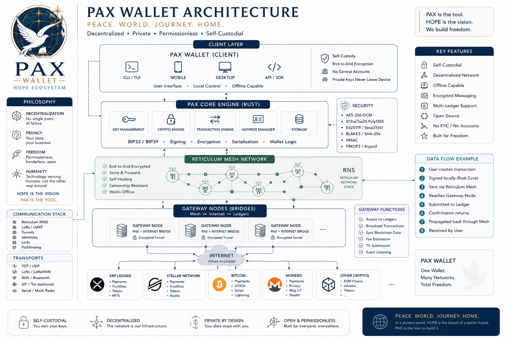
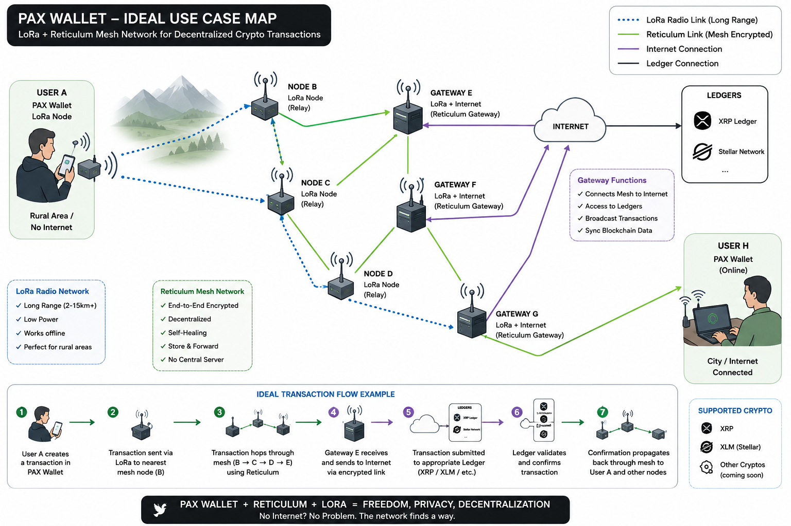

<p align="center">
  
</p>

---

# 🕊️ PAX Wallet

> **Payment Autonomous eXchange — Peace Through Free Money**

[](https://github.com/argo79/pax-wallet/releases)
[](https://opensource.org/license/gpl-3.0)
[](https://www.python.org/downloads/)
[](https://www.rust-lang.org/)
[](https://github.com/markqvist/Reticulum)

---

## 📖 Overview

**PAX Wallet** is a free, decentralized, human-centric wallet designed for peer-to-peer payments over the **Reticulum** mesh network.

🕊️ **PAX** means **Peace** in Latin and stands for **P**ayment **A**utonomous e**X**change.

Part of the **HOPE Ecosystem (Human Open Payment Ecosystem)**, PAX Wallet promotes a vision of:

- 🌍 Borderless finance
- 🔓 Permissionless payments
- 🤝 Peer-to-peer networking
- 🕊️ Human sovereignty
- 💸 Free and open money




---

## 🔧 Technical Specifications

| Component | Technology |
|-----------|------------|
| **Core Engine** | Rust (`wallet_core.so` / `wallet_core.dll`) |
| **CLI Framework** | Python 3.11+ |
| **Networking** | Reticulum |
| **Database** | SQLite3 |
| **Cryptography** | ECDSA, SHA-256, Base58, BIP32, BIP39 |
| **XRP Support** | `xrpl-py` |
| **XLM Support** | `stellar-sdk` |

---

## 🛡️ Security & Cryptography

### Rust Core

- ✅ Memory-safe architecture
- ✅ Ownership model prevents memory corruption
- ✅ Compile-time type safety
- ✅ High-performance cryptographic operations
- ✅ Safe Python bindings through FFI

### Cryptographic Standards

| Standard | Purpose |
|----------|---------|
| **BIP32** | Hierarchical Deterministic wallets |
| **BIP39** | 12/24-word mnemonic recovery |
| **ECDSA** | Digital signatures |
| **SHA-256** | Secure hashing |
| **Base58** | Address encoding |
| **AES-256** | Optional encrypted wallet storage |

### Network Security

Reticulum provides:

- 🔐 End-to-end encryption
- 🌐 Fully decentralized networking
- 🔄 Automatic mesh routing
- 🆔 Cryptographic node identities
- 🚫 No central servers
- 🚫 No DNS infrastructure required
- 🚫 No public IP address required
- 📡 Works over radio, Wi-Fi, Ethernet, LoRa and other transports
- 🌍 Operates on local, mesh, or Internet-connected networks
- 🔀 Multi-hop packet forwarding
- 🛡️ Resistant to censorship and infrastructure failures
- ⚡ Self-organizing network topology
- 📦 Store-and-forward messaging for intermittently connected nodes
- 🔑 Self-sovereign cryptographic identities
- 📁 Secure transfer of files and documents
- 🪪 Private exchange of digital credentials and identity documents
- 🚗 Secure sharing of licenses, certificates, and permits
- 💬 Private peer-to-peer messaging
- 💳 Native support for decentralized payments
- 🔒 No trusted third party required
- 👤 Pseudonymous operation by design (no mandatory accounts or personal registration)

---

## 🚀 Features



### Wallet Management

| Feature | Status |
|---------|--------|
| Create HD Wallet | ✅ |
| Import Wallet | ✅ |
| Multi-Wallet Support | ✅ |
| Child Address Derivation (XRP) | ✅ |
| Balance Check | ✅ |

### 📥 Supported Import Formats

#### 🌱 BIP39 Mnemonic (12/24 words)

```text
abandon abandon abandon abandon abandon abandon
abandon abandon abandon abandon abandon about
legal winner thank year wave sausage worth useful
legal winner thank year wave sausage worth useful
legal winner thank year wave sausage worth title
```
🔑 XRP Private Key

```text
E4A1F8B3C29D6E7F80123456789ABCDEF0123456789ABCDEF0123456789ABCD
```
⭐ Stellar Private Key

```text
SA4KQ7M9X2Y5N8P3R6T1V4W7Z0B2C5D8E1F4G7H0J3K6L9M2N5P8Q1R4T7V
```
📱 Xaman Numeric Backup

```text
123456-654321-987654-112233-445566-778899-123456-654321
```

###    ⚠️ All values shown above are examples only and cannot access any real wallet.

---

### Transactions

Feature Status

- Send XRP    ✅
- Send XLM    ✅
- Token Transfers ✅
- Trustlines  ✅
- Transaction Memos   ✅

### Reticulum Integration

Feature Status

- Gateway Mode    ✅
- Peer Discovery  ✅
- Gateway Metrics ✅
- Mesh Routing    ✅
- Offline Store & Forward ✅

### Security

Feature Status

- Encrypted Wallet Storage    ✅
- Backup & Restore    ✅
- Mnemonic Recovery   ✅
- Multi-Signature Wallets 🚧 Planned
- Cold Storage Signing    🚧 Planned

## 🏗️ Architecture

```text

                +-------------------------+
                |      Python CLI/TUI     |
                +-----------+-------------+
                            |
                            |
                +-----------v-------------+
                |      Rust Core Engine   |
                |  Cryptography / Wallet  |
                +-----------+-------------+
                            |
          +-----------------+-----------------+
          |                                   |
+---------v---------+               +---------v---------+
|       XRP         |               |        XLM        |
|     xrpl-py       |               |   stellar-sdk     |
+-------------------+               +-------------------+
                            |
                    +-------v--------+
                    |   Reticulum    |
                    | Mesh Networking|
                    +----------------+
```

---

# 📦 Installation

## From Release (Recommended)

### Linux
```bash
wget https://github.com/argo79/pax-wallet/releases/download/v0.9.0b/wallet
```
```bash
chmod +x wallet
```
```bash
./wallet interactive
```

### Windows

Download wallet.exe and run
```powershell
wallet.exe interactive
```

---

## From Source

### Clone repository
```bash
git clone https://github.com/argo79/pax-wallet.git
```
```bash
cd pax-wallet
```

### Install dependencies
```bash
pip install -r requirements.txt
```

# Build Rust core (optional, pre-built libs included)
```bash
./build_rust_core.sh
```

# Run
```bash
python3 wallet_cli.py interactive
```

### Dependencies
```txt

bip32>=3.0.0
mnemonic>=0.20
xrpl-py>=4.0.0
stellar-sdk>=10.0.0
cryptography>=41.0.0
ecdsa>=0.18.0
base58>=2.1.0
RNS>=0.5.0
colorama>=0.4.6
```

---

## 🖥️ CLI Commands

```text
Command Description
interactive Launch interactive menu
create --name NAME  Create new wallet
import --seed SEED  Import wallet from seed
balance Show wallet balance
address Show wallet address
send --to ADDR --amount X   Send payment
history Show transaction history
info    Show wallet details
list-wallets    List all saved wallets
switch NAME Switch active wallet
trustlines  Show trustlines (XRP)
trustline-set ASSET ISSUER  Create trustline
trustline-remove ASSET  Remove trustline
send-token --token TOKEN    Send custom token
Reticulum Commands (inside interactive)
Command Description
Status  Show gateway status
Avvia gateway   Start gateway mode
Ferma gateway   Stop gateway mode
Scopri gateway  Discover gateways on network
Scopri wallet   Discover wallets on network
Peer metriche   Show peer metrics table
Miglior gateway Find best gateway for asset
Richiedi info gateway   Request gateway info
Invia transazione   Send transaction via Reticulum
```

---

## 🌐 Network Architecture
```text

┌─────────────────────────────────────────────────────────────┐
│                    HOPE ECOSYSTEM                           │
│  (Human Open Payment Ecosystem)                            │
├─────────────────────────────────────────────────────────────┤
│                                                             │
│  ┌─────────────┐    ┌─────────────┐    ┌─────────────┐    │
│  │  PAX Wallet  │◄───│  PAX Wallet  │◄───│  PAX Wallet  │    │
│  │  (Node 1)   │    │  (Node 2)   │    │  (Node 3)   │    │
│  └──────┬──────┘    └──────┬──────┘    └──────┬──────┘    │
│         │                  │                  │             │
│         ▼                  ▼                  ▼             │
│  ┌─────────────────────────────────────────────────────┐    │
│  │              Reticulum Network (Mesh)               │    │
│  │         Encrypted, Decentralized, P2P              │    │
│  └─────────────────────────────────────────────────────┘    │
│         │                  │                  │             │
│         ▼                  ▼                  ▼             │
│  ┌─────────────┐    ┌─────────────┐    ┌─────────────┐    │
│  │   Gateway   │    │   Gateway   │    │   Gateway   │    │
│  │  (Relay 1)  │    │  (Relay 2)  │    │  (Relay 3)  │    │
│  └──────┬──────┘    └──────┬──────┘    └──────┬──────┘    │
│         │                  │                  │             │
│         ▼                  ▼                  ▼             │
│  ┌─────────────────────────────────────────────────────┐    │
│  │         XRP / XLM Networks (Internet)              │    │
│  │         On-chain Settlement                        │    │
│  └─────────────────────────────────────────────────────┘    │
│                                                             │
└─────────────────────────────────────────────────────────────┘
```

---

## 🔐 Why PAX Wallet?

### Feature PAX Wallet  

Traditional Wallets

- Decentralized   ✅ Yes (Reticulum)   ❌ Central servers
- Privacy ✅ End-to-end encrypted  ❌ Metadata exposed
- Control ✅ Self-custodial    ❌ Third-party custody
- Network ✅ Mesh (offline-capable)    ❌ Internet only
- Fees    ✅ Minimal   ❌ High (middlemen)
- Freedom ✅ Permissionless    ❌ Gatekeepers
- Speed   ✅ Rust/Core ❌ Slow (interpreted)

---

## 🛠️ Build from Source

### Linux

```bash

./build_rust_core.sh
./build_wallet.sh
./dist/wallet interactive
```

## Windows

```powershell
# Install prerequisites
pip install -r requirements.txt

# Build (requires wallet_core.dll)
pyinstaller --onefile --console --name wallet.exe wallet_cli.py

# Run
wallet.exe interactive
```

---

## 📚 Documentation

- 🌐 [Reticulum Network Stack](https://reticulum.network/)
- 📖 [XRP Ledger](https://xrpl.org/)
- ⭐ [Stellar Network](https://stellar.org/)
- 🔑 [BIP32 - Hierarchical Deterministic Wallets](https://github.com/bitcoin/bips/blob/master/bip-0032.mediawiki)
- 🗝️ [BIP39 - Mnemonic Code](https://github.com/bitcoin/bips/blob/master/bip-0039.mediawiki)

---

## 🌍 Philosophy

> *"Money is freedom. Freedom is human. Human is hope."*

**PAX Wallet** is not just a wallet — it is a declaration of independence.

It is a tool for those who believe that **money belongs to people**, not to banks, governments, or corporations. It is for those who trust **the human spirit** over institutions, and **mutual aid** over market manipulation.

We stand for:

- 🌱 **Autonomy** — You are the only authority over your wealth. No gatekeepers, no middlemen.
- 🤝 **Solidarity** — The network is not a hierarchy; it is a community. Every node is equal, every peer is sovereign.
- 🕊️ **Freedom** — Permissionless by design, borderless by nature. No one can block, freeze, or censor your transactions.
- 🔓 **Transparency** — Open source, open network, open future. No hidden backdoors, no hidden agendas.
- 👤 **Humanity** — We are building technology that serves people, not the other way around. Not profit. Not surveillance. Not control.
- ⚖️ **Equality** — Accessible to all, regardless of origin, status, or beliefs. Your wallet is your identity. Your rights are your code.

---

**We reject:**

- Central banks that print your future
- Corporations that monetize your privacy
- Algorithms that control your choices
- Borders that limit your life
- Systems that reduce you to a number

**We build:**

- A network that does not obey
- A wallet that does not ask permission
- A community that does not exclude
- A future that is free

---

> *"Hope is not a dream. Hope is a choice. And this is our tool to make it real."*

**HOPE** is the vision of a better world.  
**PAX** is the tool to build it — together, freely, humanly.

---

<p align="center">
  <i>🌍 In a divided world, HOPE is the dream of a better future. PAX is the tool to build it.</i>
</p>

<p align="center">
  <strong>PAX Wallet - Peace Through Free Money</strong><br>
  <strong>HOPE Ecosystem - Human Open Payment Ecosystem</strong>
</p>

---

## 📜 Roadmap

### v0.9.0b (Current)
- ✅ Core wallet XRP/XLM functional
- ✅ Reticulum gateway and peer discovery
- ✅ Trustlines and custom tokens
- ✅ CLI interactive mode

---

### v0.9.5 (Next)
- 🚧 **TUI (Terminal UI)** — Curses-based interface with menus, tables, real-time updates
- 🚧 **Reticulum transaction relay** — Send/receive payments over mesh without internet
- 🚧 **Multi-language support** — IT, EN, RU
- 🚧 **Wallet export/import** — Complete backup and restore via mnemonic or JSON

---

### v1.0.0 (Stable)
- 🎯 **Complete XRP/XLM support** — Trustlines, tokens, memos, full transaction history
- 🎯 **Stable Reticulum gateway** — Production-ready, auto-discovery, peer reputation
- 🎯 **CLI improvements** — Better error handling, logging, and user feedback
- 🎯 **Offline transaction signing** — Sign transactions without network connection

---

### v1.1.0 (Enhanced)
- 🖥️ **Web UI** — Lightweight local web interface for wallet management
- 🌐 **Multi-language UI** — Complete translations (IT, EN, RU)
- 📊 **Peer analytics** — Export metrics (CSV/JSON)
- 🔐 **Encrypted wallet storage** — AES-256 encryption for local wallets
- 💳 **PayPal integration** — Convert crypto to fiat and withdraw to PayPal (via third-party gateways)

---

### Future (Beyond v1.1)
- 📱 **Native mobile client** — Android and iOS builds
- 🔄 **Atomic swaps** — Trustless XRP/XLM exchange
- 🤝 **Multi-signature wallets** — Shared accounts with threshold signing
- 🧩 **Plugin system** — Extend wallet with custom modules

---


## 🐛 Known Issues

- Initial peer discovery may take a few minutes/hours.

- On slow networks, info requests may timeout (configurable).

---

## 🤝 Contributing

Contributions welcome! Fork the repository, make your changes, and submit a pull request.
```bash

git clone https://github.com/argo79/pax-wallet.git
cd pax-wallet
git checkout -b feature/your-feature
# Make changes
git commit -m "Add your feature"
git push origin feature/your-feature
```

### Feel free to:

Open an issue

Submit a pull request

Suggest new features

Improve documentation

---

## 📝 License

Distributed under the **GNU General Public License v3.0**.

[](https://www.gnu.org/licenses/gpl-3.0)

### You are free to:

- ✅ Use this software for any purpose — personal, community, or commercial
- ✅ Modify and distribute it
- ✅ Use it to build your own projects

### You must:

- ⚠️ Keep the source code open and available
- ⚠️ Share your modifications with the community
- ⚠️ Include the same license in your derivative works
- ⚠️ Preserve the original copyright and attribution


### Special Exception

If you are an individual or a non-profit organization, you are free to use this software for any purpose, including proprietary projects, as long as you do not charge for it.

For commercial entities, the GPLv3 terms apply in full.

---

<p align="center">
  <span style="color: #FFD700; font-style: italic; font-size: 1.1em;">
    "Freedom is not free. It is shared."
  </span>
  <br>
  <span style="color: #FFD700; font-size: 0.8em; opacity: 0.7;">
    — PAX Wallet —
  </span>
</p>

---

This license ensures that PAX Wallet and its derivatives remain **free, open, and accessible** to everyone — not just those who can pay for it.

**No one can take this code, close it, and profit from it without giving back to the community.**

---

## 📊 Project Stats

<p align="center">
  <a href="https://github.com/argo79/pax-wallet/stargazers">
    
  </a>
  <a href="https://github.com/argo79/pax-wallet/network/members">
    
  </a>
  <a href="https://github.com/argo79/pax-wallet/issues">
    
  </a>
  <a href="https://github.com/argo79/pax-wallet/commits/main">
    
  </a>
</p>

---

<h3>🙏 Acknowledgments</h3><p>This project would not have been possible without the work of:</p><ul> <li> <strong>Reticulum Network Stack</strong> — The amazing decentralized network stack that makes all of this possible.<br> <a href="https://reticulum.network/">🌐 reticulum.network</a> · <a href="https://github.com/markqvist/Reticulum">📦 GitHub</a> </li> <li> <strong>Mark Qvist</strong> — For creating Reticulum and the entire ecosystem around it. 🙌 </li> <li> <strong>XRPL Foundation</strong> — For the XRP Ledger protocol and its capabilities.<br> <a href="https://xrpl.org/">🌐 xrpl.org</a> · <a href="https://github.com/XRPLF">📦 GitHub</a> </li> <li> <strong>Stellar Development Foundation</strong> — For the Stellar network and its ecosystem.<br> <a href="https://stellar.org/">🌐 stellar.org</a> · <a href="https://github.com/stellar">📦 GitHub</a> </li> <li> <strong>The Reticulum Community</strong> — For support, testing, and ideas that shaped this tool. </li> <li> <strong>The HOPE Community</strong> — For the vision of a human and decentralized economy. </li> </ul><p align="center"> <i>❤️ Thank you to everyone who contributes to the project, reports bugs, and suggests improvements!</i> </p>

---

<h3>📧 Contact</h3><p> <strong>Email:</strong> arg0netds@gmail.com<br> <strong>GitHub:</strong> <a href="https://github.com/argo79/pax-wallet">https://github.com/argo79/pax-wallet</a><br> <strong>RNS Identity:</strong> <code>04511923b68ae34e0fda5721d82f596f</code> </p><p align="center"> <i>📡 Reach me via Reticulum using the identity hash above!</i> </p>

---

## 💰 Donations

If PAX Wallet is useful to you, consider buying me a virtual coffee! ☕  
Every contribution, big or small, helps keep development alive.

| Cryptocurrency | Address |
|----------------|---------|
| **XRP** (Ripple) | `rBKbetm51vuQQfg4Yo8fvweRya7gedcr9J` |
| **ETH** (Ethereum) | `0xd2d85288df96B4162814Ca7492039620371b9D81` |
| **XMR** (Monero) | `87jacZEtYvXcgnvEp7wu45gLwRBYpvwMr3N9dqhNipPWV69XwQX658tS73VEdghLopG1wA4STEdMPcGF8Tc3e18eJyQ4kMA` |

*🙏 Thank you for your support! Every donation is an incentive to improve and add new features.*

---

<h3>🕊️ Philosophy</h3><blockquote> <p><em>"Money is freedom. Freedom is human. Human is hope."</em></p> </blockquote><p> <strong>PAX Wallet</strong> is not just a wallet — it's a statement. </p><p>We believe in:</p> <ul> <li><strong>Decentralization</strong> — No single point of failure, no central authority</li> <li><strong>Privacy</strong> — Your transactions are your business</li> <li><strong>Freedom</strong> — Permissionless, borderless, open</li> <li><strong>Humanity</strong> — Technology serving humans, not the other way around</li> </ul>

---

<p align="center"> <i><strong>HOPE</strong> is the vision. <strong>PAX</strong> is the tool.</i> </p><p align="center"> <i> 🌍  In a divided world, HOPE is the dream of a better future. PAX is the tool to build it. </i> </p>

<p align="center"> <strong>PAX Wallet - Peace Through Free Money</strong><br> <strong>HOPE Ecosystem - Human Open Payment Ecosystem</strong> </p><p align="center"> <a href="https://github.com/argo79/pax-wallet">Repository</a> · <a href="https://github.com/argo79/pax-wallet/issues">Report Bug</a> · <a href="https://github.com/argo79/pax-wallet/releases">Release</a> </p>

---

## 🕊️ About the Name

**PAX** is the Latin word for **Peace**.

In this project, it stands for:

> **P**ayment **A**utonomous e**X**change

A wallet that is:
- **Autonomous** — You are the only authority over your wealth
- **Exchange** — Send, receive, and swap value freely
- **Payment** — Simple, fast, borderless

---

<p align="center">
  <i>
    🌍 In a divided world, HOPE is the dream of a better future.<br>
    PAX is the tool to build it — together, freely, humanly.
  </i>
</p>

<p align="center">
  <strong>PAX Wallet — Peace Through Free Money</strong><br>
  <strong>HOPE Ecosystem — Human Open Payment Ecosystem</strong>
</p>


